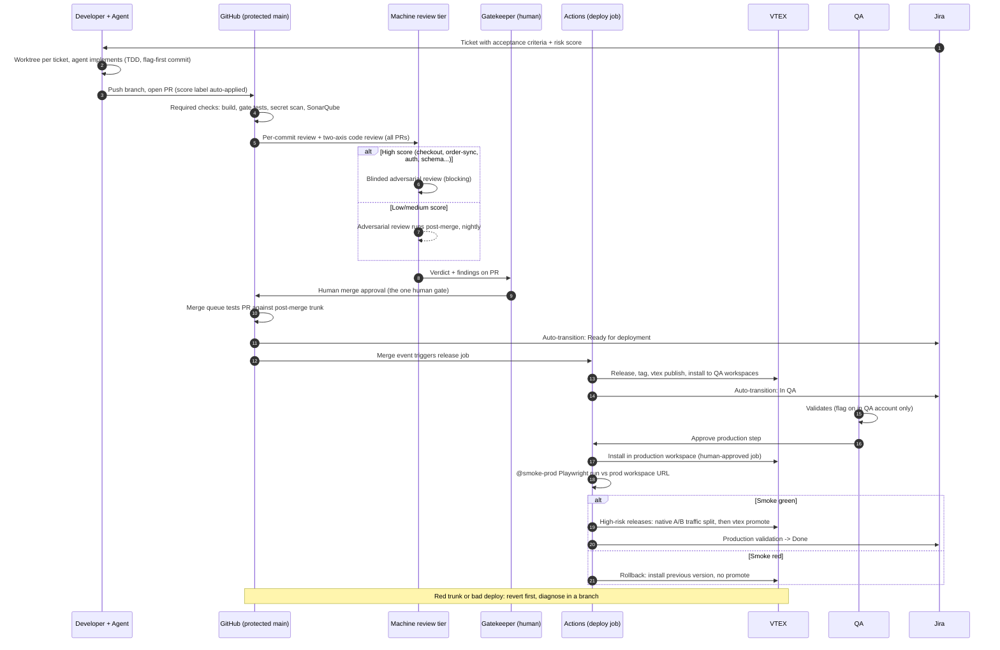
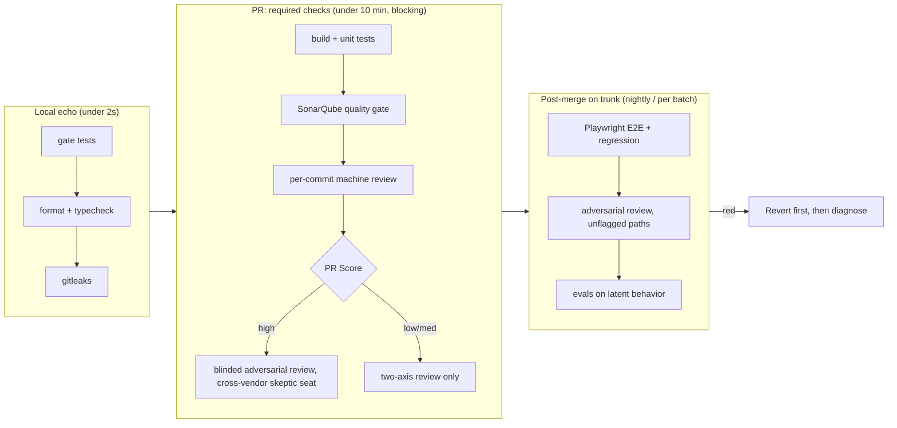

# Current SDLC vs Greenfield.md: Comparison Report

## Context

USESI's current process (the seven docs in `current_process/`) is a trunk-based SDLC built around VTEX, Jira, and GitHub, with a human Gatekeeper running review and release by hand and AI in an assistant role (Copilot autocomplete, PR suggestions, test generation). Greenfield.md (renamed from `Christian.md`) is a team AI workflow where agents generate most implementation output and humans hold two gates: approve the plan, approve the merge. This report compares them difference by difference with a verdict per difference (section 2-3), lays out the target workflow with diagrams (4), audits the tool stack with best-in-class and cost-effective picks per gap (5), covers the functions outside the build loop (6), goes deep on fifteen practice areas (7), and records what an outside research validation pass corrected and added (8).

One framing correction first: the two processes are closer than the prompt implies. The current process is **already trunk-based** (Beta releases.md: "We use Trunk Based Development"; the SDLC diagram shows short-lived `feature/usecom123` branches off main). Greenfield.md's default is branch-based stacked PRs, but its Part 6 trunk variant is the natural mapping to USESI. So the branching model is not the real difference. The real differences are **who writes the code, what enforces the rules, how review scales, and how much of the release path is a human doing ceremony by hand.**

---

## 1. The two processes at a glance

| Dimension | Current USESI process | Greenfield.md |
| --- | --- | --- |
| Branching | Trunk-based, short-lived feature/bug branches off main | Branch-based stacked PRs by default; Part 6 trunk variant (stacks merge same day, depth ≤3) |
| Who writes code | Humans, AI assists (Copilot/Cursor autocomplete, test gen) | Agents write most code, humans direct and approve |
| Code review | Human Gatekeeper + Copilot suggestions; PR Score framework (14 weighted criteria) routes human attention | Machine-first: RoboRev per commit, two-axis /code-review (Standards + Spec), blinded adversarial review; human approves merge |
| Enforcement | Conventions and agreements ("Copilot always required", "lock PR after approval"); GitHub Actions validate build/tests; SDC doc admits flow "not fully followed 100% of the time" | Required status checks on a protected branch; "a gate on a laptop is not a gate"; pre-commit is the echo, the server check is the gate |
| Feature flags | First commit adds flag, last commit may remove it; admitted not implemented 100% of the time | Mandatory day one under trunk; flag expiry dates, monthly ledger sweep, branch-by-abstraction for big work |
| Deployment | Manual Gatekeeper ceremony: release, tag, `vtex publish`, install per workspace/account; weekly batches; "blocked deployments" problem; beta releases proposed as relief valve | Deploy per ticket when green; canary baseline before, ten-minute watch after; revert-first on red trunk; merge queue |
| Testing | TDD preferred; unit coverage ramp 25% → 80%; Playwright E2E future work; scheduled regression | Gate tests <2s every commit; E2E in loop; evals as a required check for latent (AI) behavior; flaky-test quarantine |
| Work queue | Jira; ticket manually reassigned dev → Gatekeeper → QA → dev through 8 statuses | Machine-readable tracker; label vocabulary agents can act on; acceptance criteria written on the ticket are the contract the merge gate checks |
| Knowledge | Confluence pages, CONTRIBUTING.md, meeting recordings, the Gatekeeper's head | Canon committed in the repo (CLAUDE.md, docs/rules/), readable by every agent; artifact chain stage to stage |
| Harness | Each dev's Copilot/Cursor/ChatGPT configured individually | Committed `.claude/`, private plugin marketplace, managed settings floor: every agent runs the same rules |
| Observability | SonarQube dashboards, Slack notifications on PR/ticket events | OTel telemetry: cost per skill/agent, lines shipped, accept rates; weekly /health and /retro |
| Cost model | Not addressed | Buy per-seat, self-host per-activity; four priced stacks; model metered bills at 5x PR volume |

---

## 2. Difference by difference: pros, cons, verdict

### 2.1 Who writes the code: AI-assisted vs AI-generated

**Current:** Copilot/Cursor autocomplete, unit test generation, "non-critical tasks" (docs, formatting), asking for review before creating a PR. Explicitly human-in-the-loop everywhere (CI - CD.md, AI involvement section).

**Greenfield.md:** Agents produce most of the diff. Humans move up a level: write the ticket's acceptance criteria, approve the plan, approve the merge.

| | Pros | Cons |
| --- | --- | --- |
| Current | Every line had human attention; failure modes are familiar; no new trust problem | Throughput capped by typing and reading speed; the 80% coverage ramp and E2E backlog stay "future work" because human hours are the constraint |
| Greenfield.md | Throughput scales with agent count, not headcount; tests and docs stop being deferred because they cost minutes, not days | Volume outruns human review (Greenfield.md's own opening problem); requires the whole enforcement layer to be real before it is safe |

**Verdict:** Adopt Greenfield.md's direction, but only at the rate the gates in 2.3 come online. AI-generated code without machine gates is the one clearly dangerous square in this whole comparison. The current process can raise AI involvement one notch at a time: agent-written tests first (already accepted practice), then agent-written implementation on low-score repos (the PR Score framework's repo tiers are a ready-made risk ladder), then everywhere.

### 2.2 Review: human-rationing vs machine-first

**Current:** The PR Score framework exists to solve a scarcity problem: human review attention is the bottleneck, so 14 weighted criteria decide which PRs get whose attention. Copilot adds suggestions but a human Gatekeeper is the gate. CI - CD.md's "areas of opportunity" list is telling: resolve Copilot feedback before handing to a reviewer, explain rejected feedback, keep the PR updated. All of it is managing the human queue.

**Greenfield.md:** Review is layered machines: RoboRev on every commit, /code-review on two axes (Standards vs repo conventions, Spec vs what the ticket asked), a blinded adversarial review whose reviewer never saw the conversation, and the human approves at the end. The Part 6 variant risk-tiers the expensive blinded review: blocking on auth/payments/schema/contracts, nightly post-merge elsewhere.

| | Pros | Cons |
| --- | --- | --- |
| Current | The Score framework encodes real, earned knowledge: which repos are dangerous (checkout, integrations, order-sync), what change types are risky. That taxonomy is valuable | It rations a resource (human attention) that AI volume will exhaust no matter how well it is rationed. Copilot review is the weak form: it can read repo custom instructions now, but it is unblinded and, since June 2026, metered per review |
| Greenfield.md | Scales linearly with output; the Spec axis catches "built the wrong thing," which is the dominant agent failure; blinding removes the reviewer-saw-the-conversation bias | More moving parts; a review pipeline nobody maintains rots; humans can rubber-stamp if the machine verdict is trusted blindly |

**Verdict:** Adopt Greenfield.md's machine-first review, and **keep the PR Score framework as the routing table for the risk tiers.** This is the single best merge of the two documents: the Score framework's repo/change-type/impact criteria stop deciding *which human reviews* and start deciding *which tier of machine review blocks the merge* (high score = blinded adversarial review blocking; low score = RoboRev + two-axis review only, adversarial pass nightly). The framework survives; its consumer changes. With three AI vendors under enterprise agreement, the blocking reviewer can also be a genuinely different model from the author; section 4.5 lays that out.

### 2.3 Enforcement: agreements vs required checks

**Current:** The docs are honest about this: "The current flow is not fully followed 100% of the time" and "Feature flags are not being implemented 100% of the time" (Software Development Cycle.md). Rules like "Copilot always required as reviewer," "lock PR after approval," "delete branch after merge" are written agreements. GitHub Actions run, but the docs also note actions carry inherited broken steps from upstream repos.

**Greenfield.md:** Rule four of five: a gate on a laptop is not a gate. Required status checks on a protected branch cannot be merged past by anyone, including whoever configured them. Pre-commit is the fast local echo, never the gate itself.

| | Pros | Cons |
| --- | --- | --- |
| Current | Flexible; a senior person can use judgment in an emergency | The two "not 100%" admissions are the direct cost. Every agreement-based rule degrades under deadline pressure, and agents degrade it faster because an agent told to work around a red hook will |
| Greenfield.md | Compliance stops being a personality trait; the same gate binds humans and agents; emergencies go through revert, not bypass | Requires the gate to be fast and green-by-default or it gets resented; someone must own it (a red gate that is normal is decoration) |

**Verdict:** Adopt Greenfield.md's version wholesale. This is the highest-value, lowest-cost difference in the entire comparison, and it is a precondition for 2.1. For a human team adopting AI, this is the first thing to do: the org already pays for GitHub with an organization (Copilot org integration exists), so branch protection and required checks are configuration, not purchase. One sharpening from the validation pass: "cannot be merged past by anyone" is only true if configured deliberately. Use repository **rulesets** (GitHub's successor to classic branch protection) with an **empty bypass list**, alert on ruleset changes in the audit log, and put Entra PIM (5.3) on the roles that can edit rulesets. Classic protection with default settings lets admins bypass.

### 2.4 Feature flags: preferred vs load-bearing

**Current:** The SDLC diagram makes flags the first commit and their removal the last, which is genuinely good practice, but the docs admit inconsistent adoption, and there is no flag lifecycle: no expiry, no ledger, no sweep.

**Greenfield.md (Part 6):** Under trunk-based, flags are how incomplete work reaches trunk at all, so they are day-one mandatory in every stack. Every flag gets an expiry date at creation; a monthly sweep deletes flags at 100% or 0% rollout. Work too big for a boolean uses branch-by-abstraction instead of a long branch.

**Verdict:** Adopt Greenfield.md's discipline. The current process already believes in flags; what it lacks is enforcement (a gate check that new user-facing behavior ships flagged) and hygiene (the expiry/sweep, because every stale flag is an untested code path an agent will reason about wrongly). This also shrinks the need for the beta-release mechanism; see 2.6.

### 2.5 Deployment: hand ceremony vs automated per-ticket

**Current:** After PR approval, the Gatekeeper personally: updates local main, releases the app (CHANGELOG, manifest, git tag), pushes branch and tag, runs `vtex publish`, creates a productive workspace, `vtex install`, reassigns the Jira ticket, waits for dev tests, switches to master WS, installs again, hands to QA, waits, then switches to the production account and installs again. Deployments batch weekly; batching causes the "blocked deployments" problem the CI/CD and Beta releases docs both exist to fight.

**Greenfield.md:** Merge-on-green deploys per ticket. Canary baseline captured before deploy, ten-minute watch after, rollback is a button or a revert. A merge queue keeps trunk green under concurrent merges. CI latency is treated as the merge rate, so runner speed is structural rather than a cost line.

| | Pros | Cons |
| --- | --- | --- |
| Current | The Gatekeeper's manual walk catches problems machines were never asked to check; weekly batches concentrate risk into a known window | The Gatekeeper is a single point of failure and a throughput ceiling; batching is what creates blocked deployments; every manual `vtex` step is unwritten knowledge |
| Greenfield.md | Deploys stop competing for a weekly slot, so one bad ticket blocks only itself; automation makes the release path testable and documented by definition | VTEX is the honest obstacle: CI - CD.md notes automation is CLI/browser only and version collection needs a GitHub workaround. Full automation is real work, not a toggle |

**Verdict:** Adopt Greenfield.md's target, staged. The release ceremony is scriptable today: everything the Gatekeeper types (`vtex publish`, workspace create, `vtex install`, tag, changelog) is CLI and can run in GitHub Actions keyed off the merge, with the Jira transition automated from the same event. Keep a human approval step on the production-account install until the gate layer has months of history. The CI/CD doc already wants exactly this ("deploy as soon as Jira item is Ready for deployment"); Greenfield.md supplies the enforcement and revert discipline that makes it safe.

The validation pass surfaced the piece neither document had: **VTEX ships a native progressive-rollout primitive.** The platform supports release, publish, install into a production workspace, a native A/B test splitting traffic between that workspace and master (CLI or the Admin A/B Tester app, whole-number traffic proportions, auto-ending), and `vtex workspace promote` to make the tested workspace master. That is a canary deploy in VTEX's own vocabulary. High-risk releases (checkout, order-sync) should route through it instead of installing straight to master: publish, install to a prod workspace, smoke it, split a slice of traffic, promote on green. Two caveats, also verified: CI authentication for the CLI is feasible but rides an undocumented path (the first-party `vtex/action-toolbelt` actions write the session files an interactive `vtex login` would create; a years-open toolbelt issue confirms no supported token flag exists), so pin the action and CLI versions and treat auth as a watched dependency; and there is no public evidence of teams running the full publish-to-promote pipeline in CI, so phase 6 is genuine engineering with prior art only for the auth and test steps.

### 2.6 Blocked-deployment relief: beta releases vs flags + merge queue

**Current:** The Beta releases proposal publishes `x.y.z-beta.n` to VTEX from an unmerged branch, so QA can test in productive/master workspaces without blocking the weekly train. The Gatekeeper edits manifest.json outside the normal rules to do it.

**Greenfield.md:** The same problem (work that might not pass, sharing a repo with work that will) is solved by merging dark behind a flag, with a merge queue testing each PR against post-merge trunk state, and revert-first when trunk goes red.

| | Pros | Cons |
| --- | --- | --- |
| Beta releases | Works within VTEX's real constraints; no customer exposure; already specced with version rules and criteria | It is testing *unmerged* code: the branch diverges from main while QA runs, and what was tested is not what merges. It also requires a rule exception (Gatekeeper edits manifest mid-PR), and Greenfield.md's anti-pattern list names this shape: a branch that outlives the day is long-lived branching whatever the diagram says |
| Flags + merge queue | What QA tests is what merged; no version arithmetic (`patch+1-beta.n`) or VTEX limitation workarounds; the flag flips on per environment | Needs the flag discipline from 2.4 to actually exist first; some VTEX-level changes (manifest, dependencies) cannot hide behind a runtime boolean |

**Verdict:** Prefer flags + merge queue as the default; keep beta releases as the narrow tool for the cases a runtime flag cannot cover (VTEX dependency and manifest-level changes). The current criteria list in Beta releases.md (checkout, integration, b2bstore, order-sync; order placement, auth) is exactly the flag-first list, not the beta-first list.

### 2.7 Testing and evals

**Current:** TDD preferred and demonstrated (the order-sync walkthrough doc), coverage targets with dates, GitHub Actions run tests, SonarQube quality gates, Playwright E2E and scheduled regression as future work. Test automation was explicitly out of scope in the original SDC doc, and the CI/CD doc is the effort to bring it in.

**Greenfield.md:** Same direction, plus three things the current docs do not have: sub-2-second deterministic gate tests on every commit; flaky-test quarantine (agent-written tests raise absolute flake count even at a constant rate); and **evals as a required check** for latent behavior, so a prompt or skill regression fails the build the way a code regression does.

**Verdict:** Adopt the additions. The eval gate matters as soon as the org ships anything with AI behavior in it (and the moment agents write the code, the *process itself* has latent behavior worth evaluating: review-quality evals, for instance). The coverage-percent ramp in the current plan becomes far cheaper under 2.1 (agents write the tests), which converts a June deadline into a work queue. The E2E-is-too-slow objection is real and has a specific engineering answer; section 4.4 addresses it directly.

### 2.8 Work queue: status ping-pong vs machine-readable contract

**Current:** Jira drives everything, and the SDLC diagram shows the ticket reassigned person-to-person at every hop (dev → Gatekeeper → dev → QA → Gatekeeper) across eight statuses. The docs name a standing issue: three flows to reconcile (Jira, Git, VTEX).

**Greenfield.md:** One tracker with an API/MCP an agent can reach; a label vocabulary that lets an agent pick up the oldest safe `ready` issue; acceptance criteria written on the ticket before implementation, which become what the merge gate checks against.

**Verdict:** Adopt Greenfield.md's contract layer *inside Jira*: nothing here requires leaving Jira (it has an API and an MCP server; this session has one connected). The changes are (a) acceptance criteria written on every ticket before work starts, (b) status transitions automated from GitHub events instead of hand-reassignment, which also collapses the three-flow problem to one flow with two mirrors, and (c) a label/status vocabulary an agent can act on without a conversation.

### 2.9 Canon and harness parity

**Current:** Process lives in Confluence, CONTRIBUTING.md, recordings, and heads. Each developer's AI tooling (Copilot, Cursor, ChatGPT Enterprise) is configured personally. Guidelines for AI are a proposal bullet in the CI/CD doc, not an artifact.

**Greenfield.md:** Canon (CLAUDE.md + docs/rules/, coding standards, domain language, design canon) is committed in the repo where every agent session reads it. `.claude/` is committed; skills ship via a private plugin marketplace; managed settings set a floor nobody can override per machine. The test: a fresh clone plus a fresh agent produces house-style code with nobody in the room.

**Verdict:** Adopt wholesale; there is no current-process counterpart to keep. For a human team adopting AI this is the difference between "the same ticket produces three dialects of the repo" and one codebase. It is also free. The existing Confluence content (PR rules, beta criteria, TDD walkthrough) is the raw material; it moves into repo docs agents actually load.

### 2.10 Observability and cost

**Current:** SonarQube dashboards, Slack events on PR/ticket status. Nothing measures AI usage, cost, or effectiveness, which is fine while AI is autocomplete and untenable when agents do the work.

**Greenfield.md:** Claude Code OTel telemetry (one environment variable): spend by model and skill, lines shipped, accept/reject rates, PRs merged; weekly /health and /retro; per-activity vs per-seat pricing lens so agent volume does not detonate a metered bill.

**Verdict:** Adopt. When leadership asks "is the AI investment working," this layer is the answer, and the entry cost is one env var plus a backend (gap 7: Datadog as the best-in-class pane, Grafana Cloud's free tier as the alternate). The pricing lens matters for the org immediately: any tool billed per scan/snapshot/trace should be re-modeled at 5x PR volume before agents arrive, because agents multiply exactly that meter.

### 2.11 Roles: what happens to the Gatekeeper

Not a table row in either doc, but the human question behind all of them. The current process concentrates release engineering, review, and risk judgment in the Gatekeeper. Greenfield.md distributes those into machines and names owners instead (gate owner, trunk health with a revert SLA, canon owner, telemetry owner).

**Verdict:** The Gatekeeper role gets promoted, not deleted: from doing the ceremony to owning the machines that do it (gate owner + trunk health in Greenfield.md's ownership table) and holding the human merge approval on high-risk tiers. Shelly's QA moves from "test each ticket in a workspace on request" toward owning the E2E/eval suites and exploratory testing; Steve's PM work gains the acceptance-criteria discipline from 2.8. Write these down; Greenfield.md's rule that every shared surface needs a name is the part most orgs skip.

---

## 3. Which differences a human team should adopt (ranked)

1. **Server-side enforcement (2.3).** First because everything else depends on it, and on the existing plan it is configuration, not purchase. Required checks: build, tests, secret scanning, SonarQube gate.
2. **Canon + harness parity (2.9).** Free, and it is what makes N people's agents produce one codebase.
3. **Machine-first review with the PR Score framework as the risk router (2.2).** The merge of the two documents; nothing valuable is discarded.
4. **Flag discipline + merge queue over beta-releases-by-default (2.4, 2.6).** Keeps trunk-based honest; beta releases remain for what flags cannot cover in VTEX.
5. **Telemetry (2.10).** Before scaling agent output, so the scaling is measured.
6. **Automated per-ticket deploys (2.5).** Staged, keeping a human on the production install until the gates have history. Biggest workflow change, so it goes after the safety layers.
7. **Agents writing implementation (2.1).** Last, deliberately: it is the payoff, and it is only safe once 1 through 6 exist. Ramp by the Score framework's repo tiers.

Not adopted from Greenfield.md, for now: the branch-based stacked-PR default (Part 6 trunk variant fits USESI's existing trunk practice better); the full 4-stack tooling buyout (adopt the decision rules, buy tools on the named triggers in the adoption table); self-hosted environments and MCP gateways (named-trigger items, not defaults).

---

## 4. Recommended target workflow for the org

The shape: keep USESI's trunk-based flow, Jira, VTEX, and roles; replace agreements with required checks, ceremony with automation, and human review scarcity with tiered machine review routed by the existing Score framework. AI involvement then ramps inside a gated pipeline instead of ahead of one.

### 4.1 Target build-and-ship flow (per ticket)

What changed against the current diagram: the Gatekeeper's fourteen manual steps became one approval click plus one QA approval; every hand reassignment in Jira became an automated transition; review became tiered machines with the human at the end; the weekly batch disappeared.

### 4.2 The gate, tiered (Greenfield.md Part 6, mapped to USESI)

### 4.3 Adoption sequence (adapting Greenfield.md's 8 weeks to USESI)

| Phase | Do | Done when |
| --- | --- | --- |
| 1 | Rulesets with empty bypass lists + required checks (build, tests, secret scanning, SonarQube) on every active repo; fix the inherited broken Actions steps | No one, including admins, can merge past a red check |
| 2 | Commit the canon: CLAUDE.md + docs/rules/ per repo from the existing Confluence content; commit `.claude/`; acceptance criteria required on tickets | Fresh clone + fresh agent produces house-style code; a ticket is executable without a conversation |
| 3 | Machine review tiers wired to the PR Score framework; merge queue on | Every PR machine-reviewed; high-score PRs blocked on adversarial review; trunk stays green under concurrent merges |
| 4 | Flag discipline: gate check for flag-first, expiry on creation, monthly sweep; beta releases demoted to the manifest-level exception | Incomplete work merges dark instead of waiting or going beta |
| 5 | Telemetry: OTel export on, dashboard owned; weekly retro reads it | "What did agents do and cost last week" answerable without asking |
| 6 | Script the VTEX release ceremony into Actions (publish, workspace installs, Jira transitions); human approval on the production job | Merge-to-QA-installed with zero Gatekeeper keystrokes |
| 7 | Ramp agent-written implementation: low-score repos first, then by tier; VTEX Developer MCP in every harness so agents pull platform docs and API specs instead of guessing; evals as a required check on anything latent | Majority of diff agent-authored, gate history clean |

Owners to name at phase 1 (per Greenfield.md's ownership rule): the gate, trunk health (with a stated revert SLA), canon, telemetry, deploy. The natural fits given the docs: the current Gatekeeper for gate + trunk health, QA for the E2E/eval suites, PM for the queue and criteria discipline.

### 4.4 The E2E objection: "full functional testing takes too long"

Two facts from the team: most bugs are discovered in full E2E functional testing, and developers push back because it is slow. Both point at the same structural problem: E2E is being used as the primary bug net and run as one monolithic pass. The fix is not less E2E. It is E2E placed at the right gate tier and engineered for latency, and Playwright supports both.

**Placement (the tiered gate from 4.2 doing its job):**

- **Per PR, blocking:** a tagged `@smoke` subset covering only the money paths (login, search, add-to-cart, checkout, order placement, order-sync happy path), run against the ticket's VTEX workspace URL. Budget: under 10 minutes, hard.
- **Selective per PR:** map suites to app tags and run only the slices the diff touches (`--grep @checkout` when checkout files changed). A minicart PR should not wait on telemarketing tests.
- **Post-merge, nightly:** the full functional regression against the trunk-tracking QA workspace. A failure files a ticket through triage and can trigger the revert rule; it does not hold a merge that passed the smoke tier. This is the row the current process runs weekly and calls "scheduled regression"; it moves to nightly and stops competing with merge latency entirely.

**Speed engineering inside Playwright. Each is a multiplier and they compound:**

1. **Parallelism + sharding.** `fullyParallel: true` with workers per machine, then `--shard=1/4` across four CI jobs with merged blob reports. Four shards times four workers is a suite running at roughly 1/16th of serial wall-clock. This alone usually turns "45 minutes" into "under 5."
2. **Never do setup through the UI.** Authenticate once in a dedicated setup *project* (declared via `projects[].dependencies`; the older `globalSetup` config hook runs outside the test runner and loses fixtures, retries, and trace capture) and reuse `storageState` across every test; create carts, orders, and test data through VTEX APIs, not clicks. UI-driven setup is where slow suites spend most of their time, and it is also where most flakes live.
3. **Artifacts on failure only.** `trace: 'on-first-retry'`, `video: 'retain-on-failure'`, `screenshot: 'only-on-failure'`. Recording everything doubles runtime for evidence nobody reads on green.
4. **No build in the test job.** The suite points at the workspace URL the phase 6 automation already installed. Test time is test time.
5. **One retry with quarantine.** `retries: 1` in CI; a retried-pass is flagged flaky, quarantined by tag, and ticketed. Unbounded retries are how slow suites also become lying suites.

**Production smoke-after-install: the tier for what actually gets you.**

Why QA-passed code still breaks production in VTEX: the running app is composed at install time from the account's app graph (dependency versions, edition, account settings, franchise configs). The QA master workspace is a close cousin of production, not a clone, so "tested in QA" verified your code against QA's composition, not production's. Three responses, in order:

1. **Pre-install drift check.** The environment-differences audit the CI/CD doc schedules monthly becomes a per-deploy step: a script diffs installed app versions and the relevant settings between the QA and production accounts (VTEX CLI/APIs) and posts the drift summary on the deploy job before the human approves the prod install. Monthly audits catch drift eventually; a per-deploy diff catches it before it bites.
2. **Post-install functional browser smoke against production.** Immediately after `vtex install` in the production account, the Playwright suite runs its `@smoke-prod` tag against the production URL:
   - Read-only money paths: home render, search and PLP (Algolia), PDP, B2B login, logged-in pricing display, add-to-cart, cart math, checkout walked up to payment submission.
   - The permission matrix, because B2B is where composition bugs hide: the same paths as anonymous visitor, org buyer, and sales-rep roles (storefront-permissions). Regressions frequently hit one role while the role a human spot-checks stays fine.
   - One synthetic transaction if operationally acceptable: dedicated test customer, low-value test SKU, immediate cancel, asserting the order reaches order-sync intact. If a real production order is not acceptable, stop at payment and keep the order-sync assertion in QA master; either way, write which one you chose into the runbook so the residual risk has a name.
   - Budget: five minutes. Red smoke inside the watch window triggers the rollback default (install the previous version), then diagnosis.
3. **The same suite becomes the always-on synthetics.** The read-only `@smoke-prod` subset runs hourly as the uptime monitoring from gap 8. One suite, three duties: PR smoke against the workspace URL, post-install verification against production, and continuous synthetic monitoring. Written once, maintained once, by agents. The scheduler is gap 8's pick: Checkly runs the same Playwright scripts hosted from 20+ regions with trending and alerting (Starter ~$24/mo covers hourly cadence); a GitHub Actions cron is the cost-effective alternate to start on.
4. **Synthetics hygiene on production.** Scheduled browser traffic against a live storefront trips bot and fraud detection and pollutes analytics if unmarked: allowlist the synthetic runner's identity (header or IP) in any bot protection, exclude the test account from analytics (7.6's taxonomy gets an `is_synthetic` property), and keep the test SKU out of merchandising surfaces.

The current "Production validation" step (a developer manually poking around after install) becomes reading a green smoke run plus a short human sanity pass. Detection is the machine's job; the human confirms.

**The labor half of the objection dissolves under 2.1.** The historic cost of E2E is not just runtime, it is writing and maintaining selectors and fixtures. Agent-written tests drop that to review cost, which is what makes an 80-test smoke tier plus a several-hundred-test nightly suite sustainable for a team this size.

**And the deeper fix:** "most bugs come from E2E" also says the pyramid under it is thin: bugs that a millisecond unit or integration test could catch are being found by a multi-minute browser test. The order-sync walkthrough shows the team already writes good integration tests at service seams (`processOrderByID` to `processQueueRecords`); agents backfilling that layer per the coverage ramp moves discovery earlier, and the E2E tier becomes the safety net instead of the net.

### 4.5 Three vendors, one asset: the true outside reviewer

The org holds enterprise agreements with three AI vendors: Claude Code (Anthropic), Codex (OpenAI), and Copilot (GitHub/Microsoft). Used as three overlapping assistants, that is redundant spend. Used as separated roles, it buys something one vendor cannot: reviews that are independent on **two** axes at once.

Independence has two axes, and most AI review setups get only one:

- **Context independence:** the reviewer never saw the conversation that produced the code (Greenfield.md's blinding).
- **Model independence:** the reviewer is a different model family, so its blind spots do not correlate with the author's. A model reviewing code its sibling wrote shares training biases with the author; it misses the same categories of mistake for the same reasons. This is the same principle already in the team's testing rules (tests written by the pass that wrote the code inherit its blind spots), applied to vendors.

**The one rule to write into canon:** *the blocking reviewer's vendor must differ from the diff author's vendor.* Claude-authored code gets its adversarial seat from Codex; if a developer works through Codex, Claude takes that seat. Copilot's PR review joins on the high-score tier (it stopped being free-with-seat in June 2026: each review now consumes premium requests and Actions minutes, so it gets sampled, not blanket coverage).

Two calibrations from the validation pass so this section claims what the evidence supports. First, cross-vendor review is emerging practice with measurable but bounded benefit: models' errors correlate substantially even across vendors (and frontier models correlate with each other *more* than smaller ones), so a different-vendor reviewer catches some errors the author's family misses (one published case found ~16% of same-family-approved fixes had real issues a cross-family reviewer caught), not a guaranteed-independent class. It is worth doing because the marginal cost is near zero, not because it makes review failure-proof. Second, AGENTS.md is no longer just a convention to hedge with: it is a Linux Foundation-stewarded standard read natively by Claude Code, Codex, Copilot, Cursor, and 20+ tools, which makes the shared-canon requirement concrete rather than aspirational.

Concrete places to cash this in, in order of value:

1. **The adversarial tier (2.2, 4.2).** On high-score PRs, the blinded review's skeptic seats split across vendors: at least one Codex seat when Claude authored, with the quorum required to include the cross-vendor voice. The harness already supports this (the adversarial-review skill runs skeptic seats on other vendors' CLIs; a Codex wrapper skill exists).
2. **Cross-vendor test authorship on high-risk tickets.** For checkout, auth, and order-sync work: one vendor implements against the acceptance criteria, the other vendor writes the acceptance tests from the ticket alone, without seeing the implementation. Tests stop inheriting the author's assumptions, which is precisely where E2E-discovered bugs (4.4) come from.
3. **Eval grading (2.7).** LLM-graded evals are judged by a different vendor than the one whose behavior is being graded. Models score their own family's output generously; a cross-vendor judge removes the self-grading bias for free.
4. **The nightly post-merge sweep (4.2 tier three).** The unflagged-path adversarial pass alternates vendors, so over any week every merged diff has been read by a model that did not write it.
5. **Plan review before implementation (Greenfield.md layer 8).** On architectural tickets, a second vendor critiques the plan before code exists. Cheapest possible place to catch a wrong approach, and blinding is trivial since there is no conversation to leak.
6. **Second opinion on incidents.** When a root-cause analysis stalls, the same evidence handed to the other vendor's model costs minutes and breaks anchoring.

What this changes in earlier sections: the consolidation advice in 5.3 softens from "drop seats" to "re-role seats." Codex earns its agreement as the standing outside reviewer even if nobody uses it to author; Copilot earns its as the sampled extra PR signal within its meter; Claude Code remains the primary authoring harness. The telemetry in phase 5 then judges each vendor in its role, not as three copies of the same job. One practical requirement follows: keep `AGENTS.md` alongside `CLAUDE.md` (Greenfield.md layer 6) so Codex and Copilot read the same canon Claude does; a cross-vendor reviewer that never read the house rules reviews against the wrong standard.

### 4.6 Risks and honest constraints

- **VTEX automation is the long pole, and the Developer MCP helps a different phase than it first looks.** I checked the two references (vtex.com/vtex-vision/developer-mcp and developers.vtex.com/docs/guides/vtex-developer-mcp). The MCP exposes four tools: documentation search, document fetch, API endpoint search, and OpenAPI spec retrieval, plus a growing skill toolkit (42+ skills; FastStore available, VTEX IO apps and marketplace integrations marked coming soon). That is knowledge access and scaffolding for agents writing VTEX code, which materially de-risks phase 7 (agents stop hallucinating VTEX APIs). It does **not** do publish, install, or workspace management, so phase 6 remains `vtex` CLI scripted in Actions per CI - CD.md's obstacles section. Install the MCP early anyway (it is an `npx` one-liner in `.mcp.json`, committed with the harness) and watch the toolkit roadmap: if VTEX ships deploy-capable tools, phase 6 shrinks.
- **Revert discipline is the price of trunk-based with post-merge review.** Greenfield.md is explicit: a team that will not revert should not move review after the merge. Write the revert rule with a time limit before phase 3, not after the first red trunk.
- **The Score framework needs recalibration once agents write code.** Its size criteria (files, commits) assume human-shaped PRs; agent PRs skew large by default and must be stacked/split instead of scored higher.
- **GitHub plan check:** required checks on private repos need GitHub Team or above; the merge queue and Entra SSO need Enterprise Cloud (gaps 2 and 4). The org integration for Copilot suggests at least Team exists; verify the tier before phase 1, and make the Enterprise-or-third-party-queue call before phase 3.

---

## 5. Tooling: what you have, what is missing

Current named stack: GitHub (+ Actions, Copilot org integration), Sentry, SonarQube (SonarCloud per SDC tools.md), Jira, Confluence, Slack, enterprise agreements for Claude Code, Codex, and Copilot, plus Cursor and ChatGPT Enterprise assistant seats, all on top of VTEX. Measured against the capability list an AI-heavy team needs (Greenfield.md Parts 3-4), here is the audit.

### 5.1 What you have: keep, fix, or watch

| Tool | Covers | Verdict |
| --- | --- | --- |
| GitHub + Actions | Repos, CI, Dependabot (likely unused), rulesets and branch protection (unused), Pages/Packages; merge queue exists but is Enterprise-tier on private repos (gap 4) | **Keep, use more of it.** The biggest gaps below close with configuration of a tool already paid for. Fix the inherited broken Action steps the CI - CD doc names. Verify plan tier supports required checks on private repos |
| SonarCloud | Static analysis, quality gates, PR decoration, IDE integration | **Keep.** Being on SonarCloud (not Community Build) means PR analysis works, which is the part that matters. Customize the gate beyond the default, as the CI/CD doc already proposes |
| Sentry | Error monitoring (Sentry-client-monitor repo exists) | **Keep, watch the meter.** Per-event pricing is driven by production traffic, not agent activity, so it is safe under the 5x rule. It does not cover uptime or synthetics; see gaps |
| Jira | Work queue | **Keep, upgrade its role.** Atlassian ships an MCP server (connected in this session already), so Jira can be the machine-readable queue of layer 2 without migration. What it needs is discipline, not replacement: acceptance criteria on tickets, automated transitions from GitHub events, a label vocabulary |
| Confluence | Long-form knowledge, the current process docs | **Keep for humans; move canon to the repo.** Also MCP-reachable, so agents can read and write it. But agent-loaded canon (CLAUDE.md, docs/rules/) must live in git: versioned, reviewed, present in every fresh clone. Confluence holds what humans read; the repo holds what agents obey |
| Claude Code + Codex + Copilot (enterprise agreements), plus Cursor/ChatGPT seats | AI authoring and review | **Re-role, don't just consolidate.** Three vendor agreements are an asset when cast as distinct roles: Claude Code authors, Codex takes the outside-reviewer seat, Copilot as a sampled extra PR signal. Pricing correction from the validation pass: Copilot code review is no longer free-with-seat; since June 2026 each review consumes premium requests and Actions minutes, so run it on the high-score tier rather than every PR. See 4.5. Cursor and ChatGPT assistant seats get re-justified by phase 5 telemetry |
| Slack | Notifications | **Keep.** Wire the new gate and deploy events into the existing channels |
| VTEX workspaces | Per-branch preview environments | **Already own the sleeper feature.** Greenfield.md calls preview environments the single highest-value purchase for a UI product; VTEX workspaces provide them natively, free. They become the target for E2E, QA agents, and DAST below |

### 5.2 The gaps, ranked

Picks are stated best-in-class first; the alternate column is the cost-effective route to the same capability. Both close the gap; the primary closes it with the strongest tool per category, the alternate trades polish or a managed dashboard for dollars. Gap numbers are stable and referenced throughout the document.

| # | Gap | Best in class | Cost-effective alternate | When (phase from 4.3) |
| --- | --- | --- | --- | --- |
| 1 | **Secrets scanning.** Nothing scans commits or history for credentials | GitHub Secret Protection ($19/active committer, purchasable on Team): native push protection in the UI, org-wide alerting, zero integration; keep GitGuardian alongside for the second engine | gitleaks in CI (free; the official Action needs a free license key for org repos) + GitGuardian free tier (under 25 devs) | Phase 1, day one; retrofitting over a polluted history makes CI permanently red |
| 2 | **Enforced merge rules.** Configured nowhere per the docs' own admissions | Enterprise Cloud org-level rulesets with empty bypass lists, audit-log alerts on ruleset edits, PIM on the editing roles; the same upgrade carries SSO and the merge queue (gap 4) | Team ($4/user): repo rulesets and required checks work; SSO and merge queue don't | Phase 1 |
| 3 | **Machine code review at agent volume.** Copilot suggestions are advisory, unblinded, and metered since June 2026; no per-commit reviewer, no adversarial tier | Already owned, and best in class per the benchmarks: Anthropic's first-party Code Review (zero-config, every PR) + the Claude Code Action per commit + the blinded adversarial skill with a Codex cross-vendor seat on high-score PRs. Budget-alert the tokens from day one: at agent PR volume this is plausibly the plan's largest new line item | Sampled coverage: first-party review on every PR, adversarial tier only on high-score paths, Copilot review only where its meter is worth it | Phase 3 |
| 4 | **Merge queue.** Semantic conflicts (two green PRs that break each other post-merge) become routine at agent volume | GitHub's native queue, which on private repos requires Enterprise Cloud ($21/user); one upgrade buys queue + SSO + org rulesets (gap 2) | Mergify or Graphite's queue on Team; or serialize merges by convention until volume forces the call | Phase 3 |
| 5 | **Feature flag management.** Flags are hand-rolled per app via VTEX admin settings (the order-sync walkthrough); no registry, no expiry, no sweep | LaunchDarkly: the category leader, and the only vendor whose flag-lifecycle governance (stale-flag detection, approvals, audit) automates the sweep this report mandates. Governance pricing (~$25k/yr entry), and VTEX IO runtime integration is real work; buy it for the lifecycle automation or not at all | Statsig free (2M events/mo, no seat cap) or self-hosted GrowthBook (OSS, no caps); under either, the repo-level flag registry with expiry dates + monthly sweep is mandatory discipline, not optional | Phase 4 |
| 6 | **E2E + flaky-test management.** Playwright is still future work; agent-written tests raise flake counts | Playwright is best in class and free, both columns. For flakes: Trunk Flaky Tests paid tier (or Datadog Test Optimization if gap 7's primary is taken). QA Wolf (~$8k/mo floor) is the ceiling option if E2E ownership must be bought outright rather than built | Trunk Flaky Tests free tier (5 committers) or a quarantine-by-tag convention | Phases 4-6 |
| 7 | **Agent/AI observability.** No answer today to "what did AI usage cost and produce" | Datadog receiving the Claude Code OTel stream: one pane for APM, logs, LLM observability, and test optimization. Per-activity meter; model it at 5x before signing | First-party Claude Team/Enterprise analytics dashboard + OTel into Grafana Cloud free tier | Phase 5 |
| 8 | **Uptime and synthetics for the middleware.** Sentry sees thrown errors; nothing notices order-sync-service or the integrations being down-but-quiet | Checkly (runs the same Playwright `@smoke-prod` scripts from 20+ regions with trending and alerting; Starter ~$24/mo covers hourly cadence) + Better Stack for paging and the status page | Uptime Kuma self-hosted on infrastructure separate from the app + a GitHub Actions cron running the smoke subset | Phase 5 |
| 9 | **Dependency safety.** Agents install whatever dependency they decide they need, and the failure mode is not just known CVEs: agents hallucinate package names, and typosquatted/malicious packages targeting AI-generated installs became a mainstream attack vector in 2025-26 | Socket as a required check on new dependencies (purpose-built for malicious/typosquat/AI-slopsquat detection) + Dependabot (free, owned) + a canon rule that any new dependency needs human sign-off | GitHub's dependency-review action with deny rules + Dependabot + Dependency-Track v5 self-hosted when SBOM-per-build matters (v4 hits end-of-life Dec 2026) | Phase 1 (Dependabot + new-dependency gate), later (SBOM) |
| 10 | **Evals as a gate.** Nothing tests latent behavior: prompts, skills, review quality | Braintrust: the strongest eval platform (datasets, human review queues, CI gating). Metered at ~$2.50/1k scores, the textbook per-activity trap; model at 5x volume before signing | Promptfoo self-hosted (MIT, free, CI exit codes). Governance footnote: OpenAI acquired Promptfoo in March 2026; functionality and Anthropic providers unchanged, but record the ownership in the tool-choice doc | Phase 7 |
| 11 | **DAST.** Nothing probes the running app | StackHawk: CI-native DAST built for PR gating (built on ZAP's engine, per-app pricing) | OWASP ZAP baseline scan in CI against the QA workspace URL (free, maintained under Checkmarx stewardship, PR-viable in minutes) | Phase 6+, after workspace installs are automated |
| 12 | **CI speed.** Under per-ticket deploys, CI latency is the merge rate | Depot ($20-200/mo tiers plus usage; the strongest build acceleration, Docker included) or Blacksmith pay-as-you-go | Stay on GitHub-hosted runners, upsizing only the jobs where latency actually binds | Phase 6 |
| 13 | **Visual regression** | Chromatic: the category leader, Storybook-native, which pairs directly with 6.2's Storybook recommendation. Free to 5k snapshots, then $179/35k; a per-snapshot meter, so model at 5x PR volume | Playwright's built-in `toHaveScreenshot()` (zero extra dependency; run inside the official Playwright Docker image so baselines don't churn on OS font differences), adding Argos CI when shared baselines earn their keep. BackstopJS is retired from this slot: last release ~2 years old, hundreds of open issues | Optional, after 11 |

Deliberately not recommended in either column: Linear or Plane (Jira + MCP already covers layer 2; Atlassian's remote MCP went GA February 2026, needs org-admin enablement), a wiki migration (Confluence + MCP covers layer 5's shared-brain role), dedicated AI PR-review vendors like CodeRabbit or Greptile (~$24-30/dev/mo; independent benchmarks don't show a clean win over the owned pipeline in gap 3), Percy (a weaker Chromatic at higher entry price), a second memory system, and Backstage.

Reading the two columns as budgets: the alternate column keeps new recurring spend under roughly $200/mo plus the Enterprise-or-third-party-queue decision, which is where the report's earlier "mostly free" framing lives on. The best-in-class column adds real money: Secret Protection and Enterprise Cloud scale per seat, Checkly, Datadog, Socket, and Chromatic are modest, and LaunchDarkly and Braintrust are the two big-ticket items to justify individually rather than adopt by default. Two rules govern the whole table: model every metered tool at 5x current PR volume before signing, and machine-review LLM tokens remain the plan's real new meter under either column, which is why telemetry lands in phase 5 before review volume scales in phase 7. The largest cost either way is still the phase 6 VTEX engineering and the discipline items no vendor sells.

### 5.3 Upgrades to the current stack, and the Microsoft E5 dividend

Direct upgrades worth making to the five named tools:

- **GitHub: verify the tier, then decide on Enterprise.** Required checks on private repos need Team ($4/user). Two things now push toward Enterprise Cloud ($21/user) rather than one: Entra SSO/SCIM, and the merge queue, which the validation pass confirmed is Enterprise-only on private repos. In an E5 org, SSO on the platform holding the code is usually a compliance expectation anyway, so price the upgrade as buying both. GitHub Secret Protection ($19/active committer, purchasable on Team) is the paid path for gap 1 if first-party push protection is preferred over the free gitleaks + GitGuardian pair (note: gitleaks itself is free everywhere, but its official GitHub Action needs a free license key for org-owned repos). Watch the seat math: Enterprise + both GHAS products + a Copilot seat stacks to ~$109/user/mo, which is why this report buys the security layer free and upgrades the plan for exactly two features.
- **SonarCloud: keep, customize the quality gate** beyond the default, as the CI/CD doc already proposes, and make it a required check (gap 2) instead of a dashboard.
- **Sentry: keep as is.** Add release tagging from the phase 6 deploy job so errors correlate with deploys.
- **Jira/Confluence: keep, activate their MCP** so agents read the queue and the wiki directly. No migration.
- **The AI subscriptions: re-role, then consolidate on evidence.** The three enterprise agreements (Claude Code, Codex, Copilot) map to author, outside reviewer, and free PR signal per section 4.5, so all three earn their keep. The assistant-era seats (Cursor, ChatGPT Enterprise) are the ones phase 5 telemetry re-justifies or drops.

The E5 license covers four of Greenfield.md's coordination layers with tools already paid for:

| E5 component | Layer it covers | Use |
| --- | --- | --- |
| Entra ID P2 | Identity, "the tax nobody budgets" (layer, and gap, most orgs hit at tool #12) | One SSO in front of everything new this plan adds: Sentry, Grafana, Uptime Kuma, flag dashboard. Conditional access and PIM on the admin roles that own branch protection and deploy jobs |
| Intune | Harness parity (layer 6) | The managed-settings policy floor for Claude Code is delivered by MDM; Intune is that MDM. The enforcement half of harness parity, already owned |
| Power BI Pro | Observability (layer 7), the leadership view | The no-new-vendor home for weekly agent-cost, throughput, and health reporting built on the OTel data. Feed it aggregates; raw traces stay in Grafana (Pro caps at 1GB per dataset and 8 refreshes/day, which aggregates fit and raw telemetry does not) |
| Purview | Governance around AI | DLP and information-protection policies covering what leaves for AI endpoints, plus DSPM for AI, which gives org-wide visibility into AI-tool prompt/response activity; the ready-made answer when compliance asks what the agents can see |
| Security Copilot | Security ops | Included with E5 as of 2026 (a monthly compute grant per 1,000 licenses; distinct from M365 Copilot, which E5 does not include). Relevant once Defender alerts start covering the dev estate |
| Entra ID Governance (in P2) | Access hygiene | PIM for Groups and access reviews on the roles that can edit rulesets, deploy jobs, and the VTEX production account: just-in-time elevation instead of standing admin |
| Defender for Cloud Apps / Endpoint | Security posture | Shadow-AI SaaS discovery (relevant while three assistant subscriptions coexist) and posture on the machines running agents |
| Teams | Comms | Overlaps Slack, which the process docs standardize on. A consolidation decision on its own timeline; nothing in this plan depends on it |

Net effect of E5 on the plan: identity (the step Greenfield.md schedules at week 8 and warns about) and managed settings (half of week 4) are already purchased. That removes the two hidden costs this kind of rollout usually trips on.

## 6. Beyond the build loop: product, design, and active maintenance

The comparison so far is engineering-heavy because the current-process docs are. Three org functions sit outside the build loop, all three underserved today, and all three are where Greenfield.md's Define and Maintain phases apply. None of them depend on the gate work in section 4.3, so they can start in parallel.

### 6.1 Product management: intake, prioritization, socialization

**Today:** Jira holds the backlog, Zendesk holds customer contact, Confluence holds proposals, and the connections between them are people. Feedback fielding, prioritization, and roadmap communication are manual, so they happen at the cadence one PM can sustain.

**Recommended shape, with the human deciding and agents doing the assembly:**

- **Intake becomes a pipeline, not an inbox.** Zendesk and Sentry both feed a triage step: an agent classifies each item (bug, feature request, confusion, duplicate), links it to existing Jira tickets or known issues, drafts the Jira ticket with repro steps for the real bugs, and tags the theme. Zendesk has an API; Jira has the MCP already connected. The PM reviews a labeled queue instead of reading raw tickets. Build-vs-buy check first: Zendesk's own Intelligent Triage (intent/sentiment classification and routing) is included on Suite Professional and Enterprise but costs a $50/agent/mo Copilot add-on on Team/Growth tiers; look up the current plan before building the classification half, since only the Jira-linking half is custom either way.
- **Feedback synthesis on a cadence.** Weekly, an agent runs the research-synthesis pass over the period's support tickets, QA findings, and sales/CS notes: top themes, frequency, severity, representative quotes, suggested backlog candidates. This is the support-as-product-input loop Greenfield.md wires with Chatwoot-into-Linear; Zendesk-into-Jira is the same loop with tools already owned.
- **Prioritization gets evidence packets.** For each roadmap candidate, an agent assembles impact sizing (driver tree, confidence level), affected-customer counts from the intake data, and effort signal from the codebase (which repos, which risk tier per the PR Score framework). The PM ranks with evidence in front of them; the ranking itself stays human.
- **PRDs get the panel.** Draft with clarifying questions, then the seven-perspective review panel (engineer, designer, exec, legal, UX research, skeptic, customer voice) before any human meeting: seven parallel reviewers are cheaper than seven calendars, and the human review that follows starts from a stress-tested draft.
- **Socialization becomes generated, not composed.** A weekly 3P update (Progress, Plans, Problems) generated from Jira state and merged-PR data, posted to Slack and Confluence; a post-launch feature-results report checking the PRD's hypothesis against actual usage and support volume. Roadmap communication stops costing the PM an afternoon and stops going stale.

### 6.2 Visual design: a faster designer, and foundations laid by developers + AI

**Today:** docs/DESIGN.md-style canon does not exist in the current process; design work is a person, and every feature needing UI waits on that person's queue. The org already owns two underused assets: the `usesi-styleguide` repo (in the PR Score framework's repo list) and Figma-class design work happening outside the repo.

**Recommended shape, which changes the designer's job from producing screens to owning a system:**

- **Commit the visual canon.** A `docs/DESIGN.md` per Greenfield.md stage 6: tokens, type scale, spacing, component inventory, interaction states, voice. The designer writes and owns it once; every agent-built UI obeys it by default. This is the single highest-leverage design move because it converts the designer's taste from a per-screen service into a standard every session loads.
- **Developers + AI lay foundations, designer does the taste pass.** For any ticket flagged `needs-design`: the developer's agent produces working variant explorations against DESIGN.md and the styleguide components, with all states present (loading, empty, error, edge), as running UI or a comparison board, not static mocks. The designer picks, edits, and redlines a real thing instead of starting from a blank frame. Throwaway interactive prototypes answer "does this flow feel right" before any Figma investment.
- **Storybook on the styleguide repo.** Components land there first, rendered in isolation, so the designer reviews the component library rather than hunting UI through checkout flows. It also gives visual regression (gap 13) its target.
- **A slop gate for UI PRs.** UI-bearing PRs add a generic-looking-UI score plus a DESIGN.md conformance check to their review tier, so drift gets caught by machine before it reaches the designer, and the designer's review time goes to judgment, not policing.

### 6.3 Active maintenance: from monitoring to response

**Today:** Sentry sees errors, Zendesk sees complaints, Jira tracks the fixes; each is passive until a person reads it. "More active" means closing the loop between detection and action, and this is where an agent-first org gets its most visible payoff.

- **Investigate-on-alert.** A Sentry alert rule above threshold fires a webhook into a GitHub Actions workflow running the Claude Code Action: the agent reads the stack trace, pulls the release diff (Sentry release tagging from 5.3 makes the correlating deploy known), forms a root-cause hypothesis, and files a Jira ticket with the analysis, affected scope, and a proposed fix, sometimes with a draft PR that still walks through every gate in 4.2. A human wakes up to a diagnosis, not an alert.
- **Deploy-error correlation with a rollback default.** The post-deploy watch (canary baseline, ten-minute watch) plus Sentry release health means an error spike inside the watch window points at the deploy; the response is the revert rule from 4.2, and in VTEX terms rollback is `vtex install` of the previous version, which is cheap and scriptable. Decide the threshold in advance so rollback is policy, not a debate at 5pm.
- **Zendesk-Sentry cross-linking.** The 6.1 intake agent matches support tickets to known Sentry issues, which converts "how many customers does this bug affect" from a guess into a count, feeds prioritization, and lets support answer "known issue, fix is in QA" from live Jira state.
- **Scheduled maintenance as crons, not intentions.** Greenfield.md's cadence table, applied: nightly full regression (4.4) and dependency alerts; weekly health report and retro input; monthly flag sweep (4.3 phase 4), docs-vs-code audit, and security sweep; quarterly harness cleanup. Each cron files tickets through the same triage path, so maintenance findings compete in the same queue as feature work instead of living in someone's memory.
- **Uptime for the quiet failures** (gap 8) stays the prerequisite: order-sync-service down-but-silent is invisible to Sentry and Zendesk both until orders are missing. The synthetics target the money paths, same list as the smoke tier.

## 7. Deep dives: what we do, what we should do, what tools

Each topic below follows the same shape: **Today** (from the process docs and known stack), **Should** (the target practice), **Tools** (what to use, preferring what is already owned). Where an earlier section covers part of it, this expands rather than repeats.

### 7.1 Architecture governance

**Today:** Architecture decisions live in Confluence pages, meeting recordings, and heads. The CI/CD doc's "define guidelines and standards" bullet is the aspiration; nothing records a decision, its alternatives, or its rationale at the moment it is made. Six months later "why is order-sync structured this way" has one answer: ask whoever remembers.

**Should:** Two artifacts. First, ADRs in-repo (`docs/architecture/decisions/`), one short file per decision: context, options considered, choice, consequences. Written when the decision happens, and agents make this nearly free: a design conversation gets mined for the decisions it already contains and the ADR drafted from it. Second, a constitution: the project's non-negotiables as numbered, testable rules, so a review comment says "violates rule 7" instead of an opinion. Wire it into the review tier: PRs touching architecture-flagged paths (contracts, schemas, cross-app dependencies, manifest dependency changes) require a linked ADR or the check fails.

**Tools:** Markdown ADRs (MADR template) in git; ADR-extraction agent skills; the constitution as a `docs/rules/` file every session loads; a Confluence index page mirrored via MCP for human browsing. All free.

### 7.2 Developer experience

**Today:** Onboarding is tribal: Confluence plus pairing plus discovering the VTEX workspace dance by doing it. Every developer configures their own AI tooling. GitHub Actions carry inherited broken steps. Nothing measures any of it.

**Should:** Treat devex as a product with two users: the human and the agent, both hitting the same friction. Targets: a fresh laptop reaches a working `vtex link` in under an hour via a scripted bootstrap; a fresh clone plus a fresh agent produces house-style code (the phase 2 test); time-to-first-merged-PR for a new hire is measured and reviewed. Commit the harness: `.claude/`, `AGENTS.md`, `.mcp.json` (VTEX Developer MCP + Atlassian MCP), and a shared permission allowlist so nobody approves the same safe command forty times a day. Run a devex review whenever onboarding pain recurs; fix the top item each time.

**Tools:** Committed harness config (free), Intune-pushed managed settings (5.3, owned), a repo bootstrap script, Devbox or devcontainers for environment parity if node/toolchain drift appears, onboarding map generated by agent and kept current by the docs audit (7.13).

### 7.3 Product requirements documentation

**Today:** Proposals are Confluence pages in a consistent house format (the current_process docs themselves: objective, scope table, context, next steps), which is a real asset. But there is no chain from proposal to executable spec: the order-sync walkthrough shows requirements drifting initial-to-implementation-to-ideal during development, discovered in conversation rather than recorded in an artifact.

**Should:** A three-link chain, each link versioned. (1) PRD: the existing Confluence format plus two required fields, the hypothesis ("we believe X will cause Y") and the success metric (7.5). (2) Executable spec, in the repo: precise behavior, edge cases, and acceptance criteria an agent can implement against and a review can check against. (3) Tickets decomposed from the spec (7.7). Requirement changes amend the spec in a reviewed commit, so drift becomes visible history instead of surprise. Before humans meet about a PRD, the agent panel (engineer, designer, exec, legal, UX research, skeptic, customer voice) has already stress-tested the draft; the meeting starts from objections, not from reading.

**Tools:** Confluence (owned) for the PRD, repo markdown for specs, PRD-draft and review-panel skills, Jira links tying all three. No purchases.

### 7.4 Product research

**Today:** Nothing in the process docs covers it. Competitive awareness and user insight live in individual heads and sales conversations; nothing persists or accumulates.

**Should:** Two loops. **Inbound (continuous):** the 6.1 intake pipeline is the research engine you already have; weekly synthesis over Zendesk tickets, QA findings, and sales notes yields themes with frequency and severity. **Outbound (quarterly):** agent-run competitive analysis with a fixed method (scope the competitor set, score across stated dimensions, produce a decision-grade report) checked into the repo and refreshed on schedule, so the comparison is current when a roadmap debate needs it; user interviews with a prepared guide, synthesized into findings that link back to backlog candidates. Research that is not written down and findable did not happen, organizationally.

**Tools:** Research and competitive-analysis skills with web access (owned via the harness), Microsoft Forms for surveys (included in E5, no new vendor), Zendesk corpus via API, Confluence for the human-readable reports.

### 7.5 Feature success measurement (KPI)

**Today:** The CI/CD doc names ops outcomes (fewer blocked deployments), which is the right instinct applied only to process. Features ship with no declared success metric; "visible version in frontend/backend" being a next-step item shows even release identification is not instrumented yet.

**Should:** No PRD without a metric; no metric without a wire. Concretely: a north-star map for the storefront (likely order volume or quote-to-order conversion for B2B) decomposed into feature-level metrics; every PRD names the metric it moves and the expected direction; the analytics work (7.6) makes the event exist during the build, as part of definition-of-done; 30 and 60 days post-launch, an agent-generated feature-results report answers "did the hypothesis survive contact with users" and files the verdict where the roadmap discussion happens. Features that moved nothing get that fact recorded, which over a year quietly rebuilds prioritization instincts on evidence.

**Tools:** Metrics-framework and feature-results skills, the analytics stack below, Power BI (E5, owned) for the leadership dashboard.

### 7.6 Analytics instrumentation

**Today:** No process doc names a product analytics stack. VTEX provides commerce analytics and Algolia provides search analytics natively; whatever else exists is unowned. Verify what is actually installed before building.

**Should:** An owned event taxonomy in the repo: a versioned schema of events, properties, and naming conventions that agents consume when instrumenting, so five features do not invent five naming dialects. Funnels wired for the money paths (search, PDP, cart, checkout, quote-to-order). Consent gating and PII scrubbing rules stated once in the taxonomy doc. Instrumentation is part of a feature ticket's acceptance criteria, not a follow-up ticket that never gets picked up.

**Tools:** VTEX and Algolia native analytics (owned) for commerce and search. For the product analytics layer beyond that: Amplitude is the best-in-class pick (the strongest funnel/retention analysis and the tool the KPI practice in 7.5 leans on hardest); PostHog is the cost-effective alternate, earning the slot per Greenfield.md's multi-stage rule since one product covers analytics, session replay, feature flags, surveys, and error grouping on a generous free tier (set its per-product spend caps on day one). Power BI on top for reporting either way.

### 7.7 Requirements decomposition and ticketing

**Today:** Tickets are written by hand at refinement meetings, sized by conversation, with no recorded dependencies. Section 2.8 covers the contract half (acceptance criteria, MCP, automated transitions); the decomposition half is still manual judgment.

**Should:** The spec (7.3) is decomposed by an agent into tracer-bullet tickets: each independently shippable, each declaring its blocking edges, each carrying acceptance criteria written before implementation. Declared edges are what let two developers (or five agent sessions) pick non-conflicting work without a meeting. Add estimation fields to the board (model and effort per ticket, set at estimation time) so routing work to the right-sized agent is a field lookup, not a judgment call repeated per ticket. The PM reviews and adjusts the decomposition; the assembly is machine work.

**Tools:** Decomposition skills against the Jira MCP (owned), Jira custom fields for model/effort, the `ready` label vocabulary from 2.8.

### 7.8 Accessibility

**Today:** accessiBe on the storefront. Frank assessment, with the validation pass behind it: the FTC finalized a $1M settlement against accessiBe in April 2025 over false WCAG-compliance claims for this exact widget; roughly 40% of organizations sued over web accessibility in 2025 already had an overlay installed, with federal filings up 27% year over year and California's Unruh Act ($4,000 statutory damages per violation) the sharpest state exposure for anyone with California customers. Overlays remediate in the visitor's browser at runtime and do not fix the underlying WCAG failures in the source; screen-reader users report interference; and B2B procurement increasingly asks for a VPAT, which an overlay does not satisfy. It is a belt. It is not suspenders.

**Should:** Shift a11y into the loop where it is nearly free and out of the lawsuit-response budget where it is not. (1) DESIGN.md (6.2) encodes contrast-safe tokens and focus-visible states, so agent-built UI starts accessible. (2) UI tickets include a11y in acceptance criteria: keyboard path, focus order, ARIA on custom components (B2B quote tables and punchout flows are exactly where custom widgets fail silently). (3) `@axe-core/playwright` asserts no critical violations inside the E2E suite you are already building in 4.4, which makes a11y regression testing ride along at almost zero marginal cost. (4) Lighthouse accessibility budget as a required check on changed routes. Keep accessiBe while the source-level debt burns down; measure the day it can be dropped.

Four calibrations. Target **WCAG 2.2 AA** (current standard), not 2.1. Add `eslint-plugin-jsx-a11y` to lint as the earliest, cheapest gate: it catches issues at write time, before a page even renders. Know the ceiling: axe, Lighthouse, and Pa11y together catch roughly 30-50% of WCAG criteria, so a green CI gate is necessary and not sufficient; budget a periodic manual screen-reader pass (NVDA or VoiceOver on checkout and PDP) and a third-party VPAT/ACR rather than self-certifying. And sequence the overlay exit: build the remediation and gates first, get the audit, then decommission accessiBe; dropping it cold mid-transition raises exposure instead of lowering it.

**Tools:** eslint-plugin-jsx-a11y (free), @axe-core/playwright (free), Lighthouse CI (free, self-hosted), Pa11y for WCAG rule detail (free), DESIGN.md tokens, a third-party audit/VPAT, accessiBe (owned, demoted to supplemental until the exit).

### 7.9 Investigation speed

**Today:** Twenty repos, grep, and tribal knowledge. "Where is this implemented" and "what breaks if I change this" cost senior-developer time. Incident investigation starts from a Sentry stack trace and a guess; whether source maps are uploaded so traces point at real code is worth verifying.

**Should:** Three layers. (1) A queryable knowledge graph per repo, served over MCP so every agent answers architecture questions from the graph instead of re-grepping, and one shared graph rather than one per developer. (2) Cross-repo code search for the twenty-repo estate, so "who calls this API" is one query. (3) For incidents, the investigate-on-alert flow (6.3), fed by Sentry release tags and source maps so the trace lands on the diff that shipped it. Every investigation an agent runs leaves its findings in the ticket, so the next investigation starts warmer.

**Tools:** Graphify with `--mcp` (owned in the harness); for multi-repo code search, Sourcegraph is the best-in-class pick (~$59/user) and Sourcebot self-hosted is the free alternate that covers a 20-repo estate well; Sentry source-map upload in the phase 6 build step (owned); the investigate skill.

### 7.10 Internal product and feature marketing

**Today:** A Slack channel keyed to ticket status, weekly meetings, and ad-hoc announcements. Support and sales often learn a feature shipped when a customer asks about it.

**Should:** Shipping ends with telling people, and every repo already maintains a CHANGELOG (required by the current rules), so the raw material exists. Per release, an agent drafts two artifacts from the merged PRs and changelog: an engineering release note (what changed, flags, rollback notes) to Slack, and a stakeholder note (what customers can now do, who should care, what to tell them) to Confluence and the support team, including updates to relevant Zendesk macros or help articles. Monthly, a "what shipped" roundup rolls them up against the roadmap so leadership sees progress without asking. All generated, human-skimmed, sent.

**Tools:** CHANGELOG files (owned), merge-event crons in Actions, Confluence and Slack (owned), Zendesk API for help-article updates.

### 7.11 AI slop and its cleanup

**Today:** SonarCloud catches duplication and smells; nothing targets the specifically AI-shaped debris (restate-the-code comments, tombstone comments, defensive try/catch around code that cannot throw, `any` casts, style drift), and assistant-era output has been accumulating it unmeasured.

**Should:** Two cadences plus a gate. Per branch, before ship: a slop-cleanup pass over the diff, cheap because it is scoped to what changed. Monthly, repo-wide: a find, verify, fix chain, with the verification stage between finding and deleting so cleanup does not become breakage. At the gate: the code-review Standards axis cites the constitution's style rules, so new slop is caught at the PR, which over time makes the monthly pass boring. UI slop is covered by the 6.2 gate. The stale-flag sweep (4.3 phase 4) is the same discipline applied to feature flags.

**Tools:** Slop-cleanup skills in the harness (owned), SonarCloud duplication metrics as the tripwire (owned), the review tier from 4.2.

### 7.12 Codebase health monitoring

**Today:** SonarCloud grades each repo A through E, per repo, viewed when someone looks. No aggregate view across the twenty repos, no trend, no ritual that reads it.

**Should:** A weekly health report someone actually reads at a standing slot (the retro): aggregate SonarCloud scores across all repos with week-over-week deltas, test coverage trend against the ramp targets, flake count, open security hotspots, dependency alerts, stale flags, and open debt-ledger items. Monthly, an agent runs the deeper audits: dead code and circular dependencies, and an over-engineering hunt as the counterweight to months of additive agent work. Deliberate shortcuts get harvested from TODO comments into a ledger with tickets, so corners are revisited instead of rotting.

**Tools:** SonarCloud API into one Power BI or Grafana page (owned/free), health and dead-code analysis skills, the debt-ledger pattern, `docs/HEALTH-METRICS.md` to define thresholds so "unhealthy" is a number, not a feeling.

### 7.13 Documentation automation

**Today:** Confluence written by hand and drifting; CONTRIBUTING.md updated when process changes (the beta-release rules landed there); meeting recordings serving as documentation of record, which is where knowledge goes to be unfindable.

**Should:** Three automated flows. (1) Per release: an agent updates the touched docs (README, CHANGELOG already enforced, user-facing help where relevant) from the shipped diff, as part of the ship phase, not as an intention. (2) Monthly: a docs-versus-code audit by parallel agents flags every claim in the docs the code no longer supports; stale canon is worse than none because agents follow it confidently. (3) Per meeting: Teams transcripts (E5, owned) run through a notes pass producing decisions and action items, decisions feeding ADRs (7.1) and action items feeding tickets (7.7), so recordings stop being the archive. Authoring splits by audience: docs agents obey are written in the terse, imperative form agents parse best; docs humans read stay narrative in Confluence.

**Tools:** Document-release and docs-audit skills, Teams transcription (E5), Confluence MCP, writing-for-agents conventions for the canon files.

### 7.14 Security

**Today:** SonarCloud security hotspots, Copilot's incidental suggestions, and the E5 estate (Defender, Purview) on the corporate side. No secrets scanning, no SAST gate, no threat modeling, no security review triggered by what a diff touches. For an e-commerce platform handling B2B pricing, orders, and punchout auth, that is the thinnest layer in the whole process relative to its stakes.

**Should:** Layered by cadence, like everything else in the gate. **Continuous:** secret scanning on every push (gap 1), Dependabot alerts and the new-dependency gate (gap 9). **Per PR:** SAST as a required check; and a path-triggered security review, meaning the review tier automatically adds the security pass when the diff touches auth, payment, punchout, user input handling, secrets, or `manifest.json` policies, so it costs nothing on the 80% of PRs that touch none of them. **Per release:** the DAST baseline against the QA workspace (gap 11). **Periodic:** a monthly full audit, and a threat model whenever a new integration or external surface lands, with mitigations filed as tickets and test cases rather than a document that gets archived. **Corporate:** Purview DLP around what reaches AI endpoints, Defender for Cloud Apps watching for shadow AI SaaS (5.3).

**Tools:** best-in-class picks per gap table 5.2: GitHub Secret Protection + GitGuardian (secrets, gap 1), Semgrep's AppSec Platform for SAST with cross-function taint analysis and a managed dashboard, StackHawk for DAST (gap 11), Socket for dependency safety (gap 9), plus the security-review and threat-modeling skills and E5 Defender/Purview (owned). The cost-effective alternates run the same layer at $0: gitleaks + GitGuardian free, OpenGrep as the SAST engine (it restores the taint tracking Semgrep's free tier gates, but ships no rules of its own; pull the Semgrep community registry, whose license permits internal CI use), ZAP baseline, dependency-review action, Dependabot.

### 7.15 Documentation vs shared context and memory

**Today:** One undifferentiated pile: Confluence pages, CONTRIBUTING.md files, recordings, and whatever individuals remember. No store an agent reliably loads; no rule for where a given fact lives.

**Should:** Four stores with distinct jobs and one rule: a fact lives in exactly one of them.

| Store | Holds | Property |
| --- | --- | --- |
| **Repo canon** (`CLAUDE.md`, `AGENTS.md`, `docs/rules/`) | What agents must obey: standards, safety rules, workflow, the constitution | Versioned, PR-reviewed, loaded by every session on every machine. If it is not here, half the team's agents never read it |
| **Repo docs** (`docs/architecture/`, ADRs, runbooks, specs) | Durable knowledge humans and agents both consult | Versioned; audited monthly against the code (7.13) |
| **Confluence** | Human-facing narrative: PRDs, research reports, release notes, onboarding prose | Reachable by agents via MCP for reading and writing, but never the source of truth for anything an agent must obey |
| **Derived context** (knowledge graph, session handoffs, learnings ledger) | Regenerable understanding: code structure, paused-work state, accumulated lessons | Never canonical; rebuilt from the sources above. Losing it costs recompute, not knowledge |

And one anti-pattern imported verbatim from Greenfield.md: no second memory system. Once the graph and the canon exist, a third place to remember things adds sync problems, not recall. When someone proposes one, the answer is "which of the four stores does this fact belong in."

**Tools:** All owned or free: git, Confluence + MCP, Graphify, a LEARNINGS.md ledger.

## 8. Validation pass: what outside research changed and added

The report's claims were checked against current public sources (August 2026) by a nine-agent research pass: eight fact-verification sweeps (GitHub platform, accessibility, testing tools, security tooling, AI harness capabilities, flag/analytics pricing, VTEX automation prior art, Microsoft E5 contents) and one independent critic reading the full report against current AI-SDLC practice.

### 8.1 Corrections applied (already folded into the sections above)

1. **GitHub merge queue is Enterprise-only on private repos** (gap 4, 5.3): the "free, native" framing was wrong; the Enterprise upgrade now carries two features (SSO + queue), or a third-party queue covers Team.
2. **Copilot code review is metered since June 2026** (2.2, 4.5, 5.1, 5.3): demoted from always-on free signal to sampled high-tier signal.
3. **Machine-review token spend named as the real new meter** (5.2): the "$0 gaps" framing now carries the honest caveat, and budget alerts move to day one.
4. **Rulesets with empty bypass lists, not classic branch protection** (2.3): the enforcement thesis holds only when configured that way.
5. **VTEX native A/B test + `vtex workspace promote`** (2.5, 4.1): the platform ships the canary primitive; the pipeline design now ends in split-then-promote, and CI auth is flagged as a working-but-unsupported path to pin and watch.
6. **Dependency gap re-aimed at slopsquatting** (gap 9): Dependabot alone doesn't cover hallucinated/malicious packages; dependency-review deny rules and a human sign-off rule on new dependencies do.
7. **Visual regression pick replaced** (gap 13): BackstopJS is effectively unmaintained and retired from the slot; Chromatic is the best-in-class pick (Storybook-native, meter modeled at 5x), Playwright's built-in snapshots in the official Docker image plus Argos the cost-effective alternate.
8. **Playwright setup-project pattern, retain-on-failure video, flag-vendor tier caps, accessiBe FTC settlement, Zendesk triage tiers, E5 extras (Security Copilot, DSPM for AI, PIM for Groups, Power BI caps)**: all folded in place.
9. **Greenfield.md itself received three patches** (applied directly to the source document): its self-hosted-runner fee claim (announced December 2025, reversed before the March 2026 effective date, both mentions), its "merge queue free" framing (Enterprise-only on private repos, both the base-process picks table and the trunk-variant section and table), and its GrowthBook-free-tier framing (3-user cap, both the trunk-variant prose and table).

What the pass confirmed unchanged: the tiered gate, revert-first discipline, evals as a required check, flaky quarantine, the OTel telemetry claims (verbatim, including Intune delivery of managed settings), the E5 inventory, the Atlassian MCP (GA February 2026), the Sentry/Statsig/PostHog/Uptime Kuma/Promptfoo/ZAP/OpenGrep tools as sound (they now hold the cost-effective column of 5.2 after the best-in-class reframe), the accessiBe assessment (understated, if anything), and the cross-vendor review thesis (with the calibration now in 4.5).

### 8.2 What was missing: eight topics the report now owes answers

The critic found the report silent on eight things a 2026 AI-SDLC plan should cover. Each gets its position here; the ones that are load-bearing get folded into the phase table at the next revision.

**1. Agent security: prompt injection and least privilege.** The report's own intake pipeline (6.1) has agents reading raw Zendesk tickets, and 6.3 feeds Sentry payloads to agents with repo access. That text is attacker-controlled, and indirect prompt injection is the top-listed LLM risk with no reliable prompt-level defense. The rules to adopt: scope tools per task, not per agent (the intake agent gets Jira-create and nothing else, never repo write); treat all external text as data structurally, not via system-prompt reminders; require human review before any external-content-triggered action becomes a PR or a customer-visible change; vet and pin MCP servers (tool descriptions are an injection vector too); sandbox autonomous runs with egress controls. This becomes a numbered part of the constitution (7.1), not advice.

**2. CI/CD pipeline hardening against agent-authored workflow changes.** Once agents author most diffs, a PR editing `.github/workflows/` is a privilege-escalation path to the VTEX, Jira, and deploy secrets that phases 6-7 put into Actions. Mitigations, all cheap: CODEOWNERS requiring human review on `.github/workflows/` and `.claude/` paths; GitHub environment protection rules on the prod deploy job; OIDC federation over long-lived secrets where supported; third-party actions pinned to commit SHAs; `pull_request` (never `pull_request_target`) for anything touching agent-generated branches; and zizmor (free, OSS) as a required check on workflow-file diffs, which catches exactly the pwn-request and template-injection patterns a model introduces without meaning to.

**3. Incident management, the human half.** The report automates detection and rollback but never says which human, when. A one-page runbook: severity ladder, who gets paged, who declares and commands an incident, comms templates support can send, and blameless postmortems whose action items enter the same triage path as everything else, with learnings written into the repo canon so agents inherit them. Tooling follows the 5.2 pattern: incident.io ($45/user, all-in incident management with on-call and status pages) is the best-in-class pick; Better Stack (already gap 8's pairing) covers paging and the status page as the cost-effective alternate.

**4. Backup and disaster recovery.** The plan de-risks the Gatekeeper's knowledge but not the data underneath: GitHub org configuration (rulesets, environments) as code and backed up; Atlassian content on scheduled export or a backup vendor; VTEX account/app settings snapshotted on a schedule (the drift-check script from 4.4 already reads them, so writing them to storage is nearly free); stated RTO/RPO; one restore test a year. Agent automation raises the blast radius of a bad bulk operation, which makes this cheaper than the incident it prevents.

**5. Compliance and legal posture.** Three specifics for this business. PCI: keep the smoke suite's checkout walk outside cardholder-data scope (stop before payment submission, or use the payment provider's designated test instruments; confirm scope stays with VTEX's payment components). SOC 2: the controls this plan installs (rulesets, secret scanning, review tiers, audit logs) map cleanly to evidence requests B2B customers increasingly send; record the mapping once. IP: the three vendors carry different indemnification terms for AI-generated code by plan tier; record which tiers the org is on and require agent authoring to stay on indemnified tiers.

**6. An AI usage policy as a written artifact.** The enforcement machinery exists in the plan (Purview DLP, managed settings) but no policy document does: which data classes may reach which vendor endpoint, who is accountable for a merged agent-authored diff (the human approver), how agent authorship is recorded (commit trailers, already the harness convention), and the approved-tool list. Auditors and enterprise customers ask for this by name; it is a page in `docs/rules/` plus an HR-facing copy in Confluence.

**7. The people track.** The plan redefines three roles and moves developers from writing code to directing agents, and the org's own docs admit process adoption is its historic weak spot ("not followed 100% of the time"). Run a people track parallel to the phase table: paired ramp-up on agent direction, an explicit reset of what senior review means when the diff is agent-authored, deliberate hands-on-keyboard time so skills don't atrophy (junior skill formation under agent-heavy workflows is a live industry concern), and a named AI-enablement owner. Phase 5 telemetry already collects per-person accept rates; use them as the adoption metric, not as a leaderboard.

**8. Model and vendor lifecycle.** The pipeline makes merges depend on LLM vendors' availability and behavior. Three rules: a degraded mode written down in advance (when the review tier is down, human review substitutes, gated by PR score, rather than merges freezing or gates getting skipped); model versions pinned in the harness, with the eval suite (gap 10) re-run before any model upgrade so a drift in review strictness is measured, not discovered; and hard budget alerts per vendor console plus the telemetry alerts from 5.2, so a runaway loop is a page, not an invoice.

One more calibration the critic offered on the human gate: the report keeps a human merge approval on every PR, which is the right starting posture. Mature AI-first teams auto-merge the lowest-risk tier (docs, dependency bumps, low-score repos) with sampled post-merge review. The PR Score router already makes that a config change later; treat it as an option after phase 7's ramp has clean gate history, not a day-one move.

## 9. Bottom line

The current process and Greenfield.md agree on more than they differ: trunk-based, short-lived branches, flags, TDD, per-ticket deploys as the goal. The current process's gaps are the ones its own docs admit: rules held by agreement rather than machines, a release path that lives in one person's hands, and review capacity that cannot survive AI volume. Greenfield.md's answer to each is adoptable without abandoning Jira, VTEX, or the team's roles, and its best local move is reusing the PR Score framework as the router for tiered machine review. Adopt in the order of section 3; the first two items are free and reversible, and everything after them gets safer because they exist.
